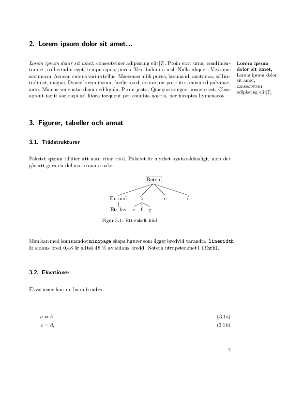

# Rapportmall LaTeX

A template for reports at Chalmers from ca 2005 and uploaded almost as is.

## Citing the template

Please cite the following publication

~~~
@misc{martin_2017_240749,
  author       = {Martin Isaksson},
  title        = {martisak/rapportmall: Original},
  month        = jan,
  year         = 2017,
  doi          = {10.5281/zenodo.240749},
  url          = {https://doi.org/10.5281/zenodo.240749}
}
~~~

## Packages
Some things are not automagically installed.

* [epipart.sty](http://tex.stackexchange.com/questions/226301/how-to-place-an-attributed-epigraph-on-a-part-page) and also [epipart.sty](https://svn.kwarc.info/repos/arXMLiv/trunk/sty/epipart.sty)

## Instructions

See `Makefile` for how to compile or just run `make`